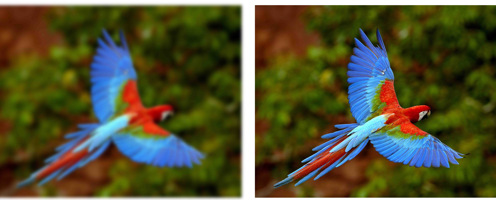
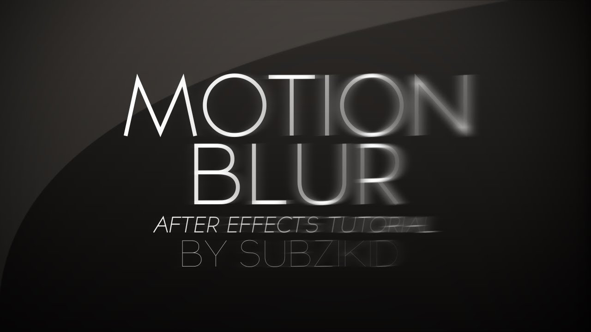
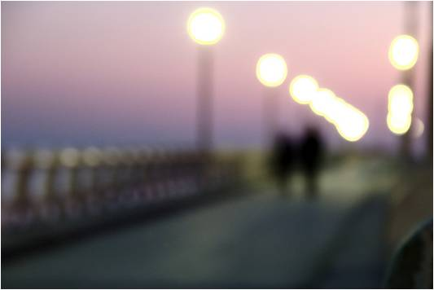

# Sharpness Estimation for Document and Scene Images

Paper: [Sharpness Estimation for Document and Scene Images](https://bit.ly/2N3dWaO)

Generally, Image Quality Analysis(IQA) is divided broadly into two types, 

1. Reference Based Evaluation, 
2. No-Reference Evaluation. 

**Reference Based Sharpness**  | **No-Reference Sharpness** 
:-------------------------:|:-------------------------:
  | 

The main difference between these approaches is (1) uses a high quality image to evaluate the quality, while (2) is purely based on image's inherent features(pixels)


Most of the researchers earlier has focused on estimating the quality of natural or scenic images. Document images, however, don't share the same characteristics with scenic images as documents are primarily composed of texts like digitized historical texts, identity documents or bill/receipts etc. Therefore, sharpness measures developed on scenic image might not extend to documents accurately. 

## Blur Types

**Motion Blur**  | **Out of Focus** 
:------------------------- | :-------------------------
  | 


Authors(Kumar J, et al.) present a very intuitive and simple measure which works on grayscale image, is comparable to state-of-art solution and takes far less time to compute as it doesn't require expensive FFT, canny-edge detection or SVD. It is effective in detecting motion-blur, de-focused images or inherent properties of imaging system.The paper claims to work better than any other perceptually-based, no-reference sharpness measures on [LIVE Dataset](http://live.ece.utexas.edu/research/quality/subjective.htm). 


## Installation
> git clone https://github.com/umang-singhal/pydom.git

## Usage
```python
from dom import DOM
import numpy as np

# initialize
iqa = DOM()

# using image path
score = iqa.get_sharpness('path/to/image')
print("Sharpness:", score)

# using numpy array
img = np.random.randint(50, size=(10,10,3), dtype=np.uint8)
score = iqa.get_sharpness(img)
print("Sharpness:", score)
```

**Note:  0 $\le$ Sharpness Score $\le$ $\sqrt{2}$**

## Tests
` nose2 -v`

## BibTex
@MISC{Kumar_sharpnessestimation,
    author = {Jayant Kumar and Francine Chen and David Doermann},
    title = {Sharpness Estimation for Document and Scene Images},
    year = {}
}